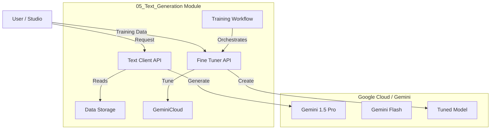

# 05_Text_Generation Blueprint 📝

## Overview
This module handles all text-based AI tasks, including creative writing, documentation generation, and **Model Fine-Tuning**.

## Architecture

## Directory Structure
-   **api/**: Client wrappers (`text_client.py`, `fine_tuner.py`).
-   **data/**:
    -   `images-Data/`: Context images for multimodal prompts.
    -   `prompts/`: Library of system prompts (e.g., "Act as a Songwriter").
    -   `training/`: Databases (JSON/CSV) for fine-tuning.
-   **flows/**:
    -   `train_diva.py`: Automates the model training process.
-   **docs/**: This blueprint and other architectural docs.

## Workflows

### 1. Creative Writing (Standard)
-   **Script**: `api/text_client.py`
-   **Features**: 
    -   **Thinking Mode**: Enable reasoning for complex plotting (`api/text_client.py` supports `thinking_budget`).
    -   **Lab**: `flows/thinking_lab.py` (Test Logic/Math).
    -   **System Instructions**: Define personas (e.g., "You are a 19th Century Poet").
    -   **Chat**: Multi-turn character dialogue.
    -   **Tools**: Function Calling support (`api/text_client.py` supports `tools`).
    -   **Lab**: `flows/agent_lab.py` (Thinking + Tools = Agent).
    -   **Structures**: JSON Schema support (`output_schema`).
    -   **Lab**: `flows/structured_lab.py` (Data Extraction).
    -   **Long Context 🧠**:
        -   **Context Caching**: `create_cache` / `generate_with_cache`.
        -   **Lab**: `flows/long_context_lab.py` (Codebase QA).
-   **Usage**: Generate lyrics, bios, scripts, or analyze massive docs.

### 2. Model Training (Fine-Tuning)
-   **Script**: `flows/train_diva.py`
-   **Input**: `data/training/dataset.json`
-   **Process**:
    1.  Upload dataset.
    2.  Configure Hyperparameters (Epochs, Learning Rate).
    3.  Submit Job to Google.
    4.  Save Model ID to `.env` for future use.
