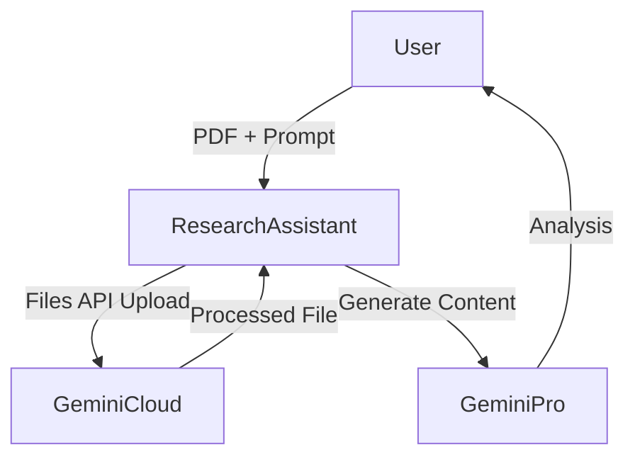

# 06_Document_Intelligence Blueprint 📄

## Overview
This module leverages **Gemini 1.5 Pro's** massive context window and native PDF understanding to process complex documents. It preserves layout (charts, tables) and can handle files up to 1000 pages.

## Architecture



## Directory Structure
-   **api/**: `doc_processor.py` (Handles File API interactions).
-   **flows/**: `research_assistant.py` (CLI tool for analysis).
-   **data/**:
    -   `contracts/`: Store legal docs here.
    -   `scripts/`: Store movie scripts/screenplays.
    -   `library/`: General research papers/books.

## Key Capabilities
1.  **Layout Understanding**: Recognizes tables, charts, and diagrams natively.
2.  **Multimodal RAG**: Can answer questions visual elements inside the PDF.
3.  **Comparision**: Can analyze multiple PDFs in a single prompt.

## Usage
```bash
python flows/research_assistant.py data/contracts/lease.pdf "Summarize the termination clause"
```
