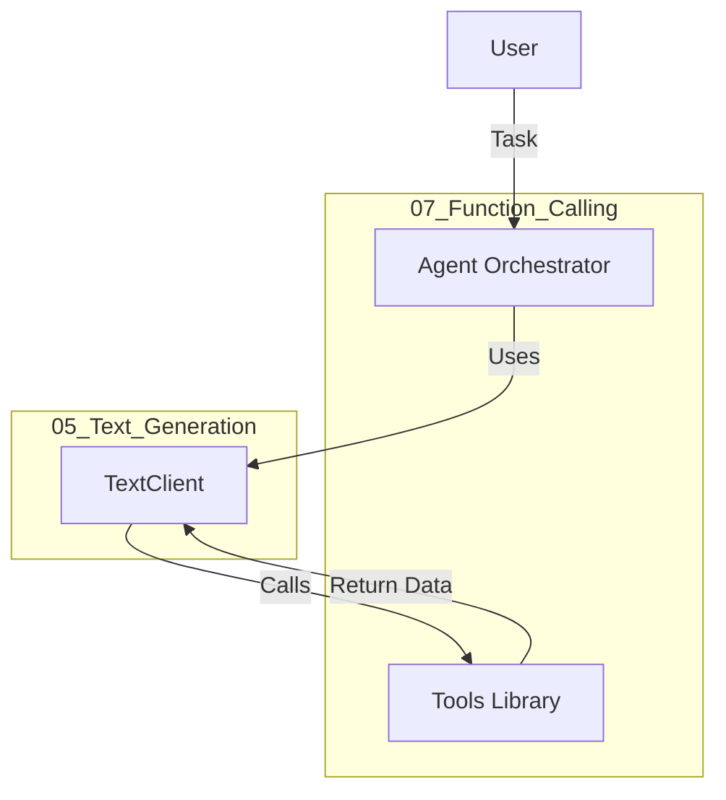

# 07_Function_Calling Blueprint 🛠️

## Overview
This module serves as the central **Tools Registry** and **Agent Orchestration** layer.
It allows the AI to interact with the world (Math, Time, Databases, APIs).

## Architecture

## Tools Library (`api/tools_library.py`)
-   **Basic**: `calculator`, `get_system_time`, `search_database`.
-   **Smart Home**:
    -   `set_light_values`: Control lighting.
    -   `power_disco_ball`: Parallel execution demo.
    -   `start_music`: Contextual action.

## Workflows
-   **Orchestrator**: `api/agent_orchestrator.py`
    -   General purpose agent.
-   **Smart Home Lab**: `flows/smart_home_lab.py`
    -   Demonstrates **Parallel Function Calling** (Running multiple tools at once).
