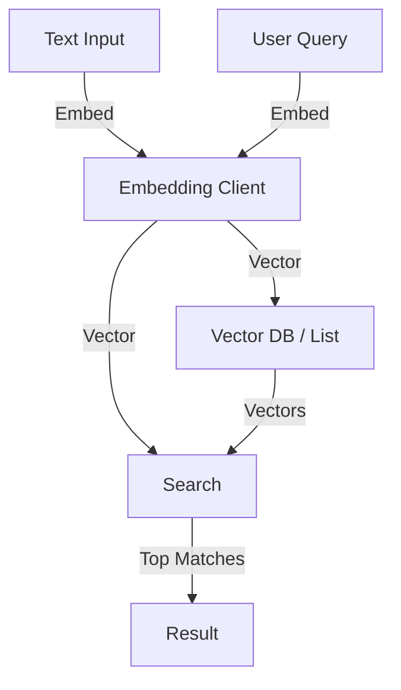

# 08_Embeddings Blueprint 🧬

## Overview
This module handles **Semantic Understanding**.
By converting text into **Vectors** (Embeddings), we can search for information based on *meaning* rather than exact keyword matches.

## Architecture

## Components
-   **Client**: `api/embedding_client.py`
    -   Uses `models/text-embedding-004`.
    -   Supports `output_dimensionality` (optimization) and `title`.
-   **Labs**:
    -   `flows/semantic_search.py`: Vector Search Demo.
    -   `flows/rag_lab.py`: **RAG (Retrieval Augmented Generation)**.
        -   Combines Module 08 (Search) + Module 05 (Generation).
    -   `flows/file_search_lab.py`: **Managed RAG**.
        -   Uses Gemini's built-in File Search Store (Zero-Config).
    -   `Generative Language/`: **System Admin Layer**.
        -   `api/model_registry.py`: Inspect Model Capabilities.
        -   `api/media_handler.py`: Manage Cloud Files.
        -   `api/cache_manager.py`: Context Caching Control.
        -   `api/token_manager.py`: Cost Estimation & Geometry.
        -   `lab/admin_console.py`: Interactive Admin CLI.

## Usage
-   **Semantic Search**: Find documents by meaning.
-   **RAG**: Answer questions using your own data.
-   **Managed RAG**: Let Google handle the chunking/indexing/storage.
-   **Recommendations**: Find similar content (movies, songs).
-   **Clustering**: Group similar items together.
